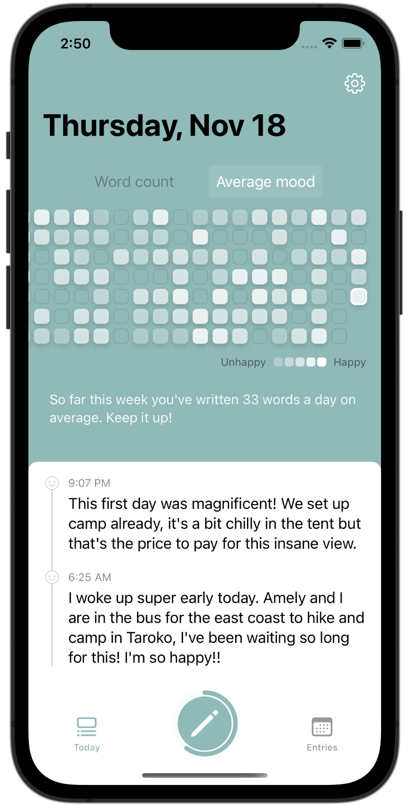

+++
title = "Home"
+++

<section class="section hero is-dark is-fullheight">
    

      

        

          

            Save memories, track your mood
          

          

              A simple, elegant journaling app that helps you track your mood. Its AI lives on your device so there's no need to steal your data.
          

          

            
          

        

        

          
        

      

    

</section>