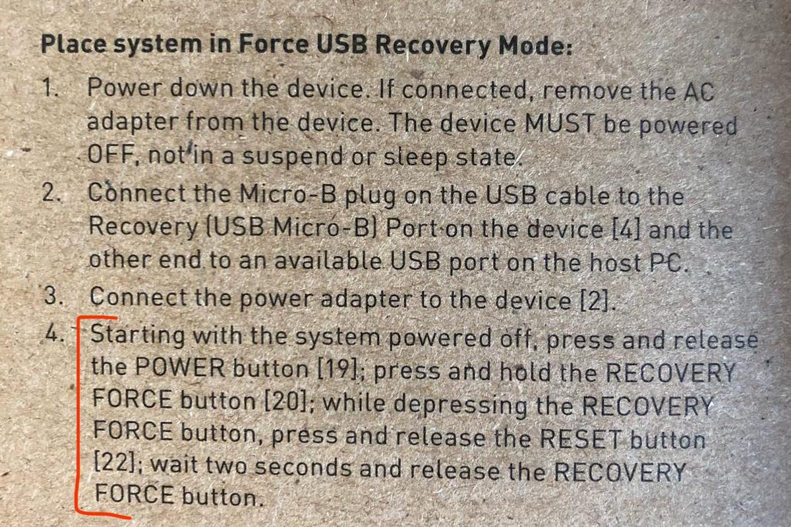

+++
title = "Setting up a Jetson TX2 with Vagrant"
date = "2019-11-16"
+++

This post is intended for those who want to flash their Jetson TX2 board
from an Ubuntu VM without a desktop environment running.

Setting up a Jetson TX2 must be done through NVidia's
[SDK Manager](https://developer.nvidia.com/nvidia-sdk-manager). Per the
requirements, it needs an Ubuntu Desktop not running in a VM. I have a Macbook
and no intention of adding a Linux dual boot next to macOS on my
always-too-small hard drive, so I gave it a go.

</img>

**[This repository](https://github.com/notsimon/vagrant-jetson) contains all the
tools and instructions** necessary to achieve just that in a minimum amount of
commands possible: it uses a Virtual Box VM configured through [Vagrant](https://vagrantup.com),
and [xvfb](http://manpages.ubuntu.com/manpages/trusty/man1/xvfb-run.1.html) underneath to
bypass the need for a GUI.

### Recovery Mode

Even if the instructions in the quick start guide of the devkit make it seem
like an absolute nightmare, putting the board in Recovery mode is quite
straightforward:

1. Power up the board (plug it and hit the PWR button)
2. Hold the REC button
3. Hit the RST button
4. Release the REC button after about 2 seconds

</img>
