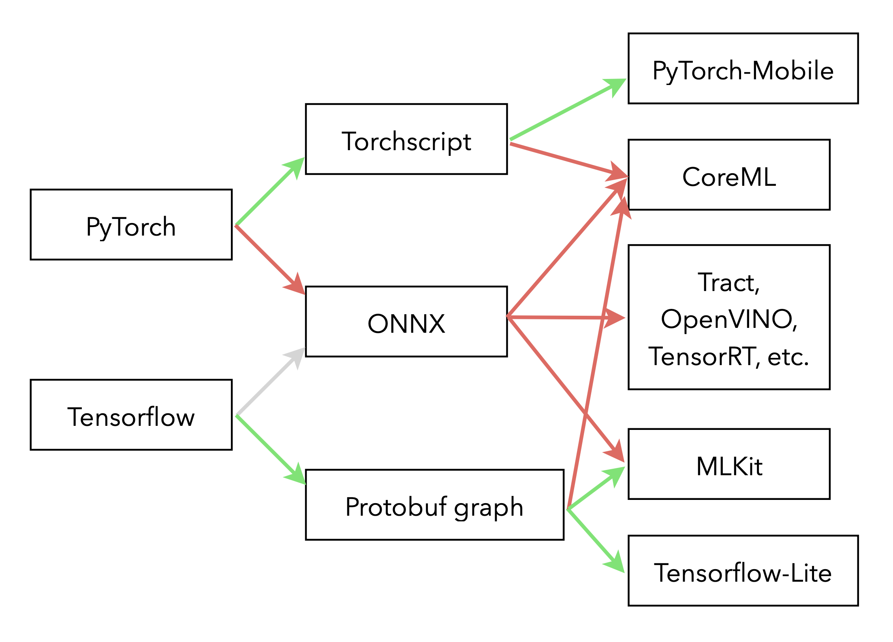

+++
title = "A pouch of tricks to deploy neural nets on mobile devices"
date = "2021-11-02"
+++

Deep Neural Networks are by nature not the most computationally efficient type of models. While their performance remains mostly unchallenged for applications that involve a high-dimensional input, deploying them in environments with limited computing power requires additional work. The first job is to reduce the algorithmic complexity of the model, that'll more likely be the job of a Data Scientist as it usually comes at a cost in accuracy that must be evaluated. In a second part a well-rounded Developer or Machine Learning Engineer must take that model and convert it to a format compatible with the inference platform of their choosing. Bellow are a few tricks I learned from experience.

_Deploying a PyTorch model to iOS with CoreML will be the topic of a tutorial I'll publish soon, stay tuned! 😉_

# Compressing the model

Three main techniques are used to reduce the overall computing power required by a neural networks: quantisation, weights pruning and knowledge distillation (see [Compressing BERT for faster prediction ][1] and [Introducing DistilBERT, a distilled version of BERT][2] for an in-depth introduction).

Quantisation is the process of reducing the precision of a model's parameters and operations to save memory and take advantage of wider parallelisation of arithmetic operations. It can be done through the usage of smaller floating-point types (typically half-precision, ie. 2 bytes instead of 4) or fixed-point operations: the former only increases rounding errors, whereas the latter requires choosing the range in which the computations are going to happen. To avoid hurting the model's performance too much, quantisation should be accounted for during training. When doing [Quantisation Aware Training][3], the training process is roughly the following:

1. Quantise the model's weights
2. Compute the loss with the quantised version of the network
3. Compute the gradient w.r.t the unquantised weights
4. Update the unquantised weights
5. Repeat

In PyTorch, quantisation can be done statically (converting a model beforehand) or dynamically (converting an intermediate output to a quantised version then back during inference) and is described in [this tutorial](https://pytorch.org/blog/introduction-to-quantization-on-pytorch/) of the framework's blog.

[Weights pruning][4] removes part of the model that have little contribution to the end result. Removing individual weights has no interest in the absence of an efficient implementation of sparse matrices operations, whereas pruning neurons entirely amounts to removing entire rows or columns of a weight matrix. In some cases, pruning entire weight matrices seems to be doable [without much loss in accuracy][5]. The decision can be taken by measuring both the neurons activations and error gradients during inference on a representative dataset. Alternating between pruning and training steps allows for the remaining neurons to compensate. PyTorch's documentation again has [a good tutorial](https://pytorch.org/tutorials/intermediate/pruning_tutorial.html) on the topic.

Finally, knowledge distillation is the process of learning a smaller model from the output of a bigger one. While being introduced six years ago [by Geoffrey Hinton][6], this methods seems to still be heavily used: it works well in practice to have a thiner and [deeper distilled model][7] (see also [here][8] and [there][9] for a lot of advice on the topic). The key insight to take away from these techniques is that they work well because of the added informations that can be used during training: for instance a classifier is trained as a regression task over the whole probability distribution over all classes of the output of original model, we can also use unlabelled examples on top of the usual training data set.

[1]: https://blog.rasa.com/compressing-bert-for-faster-prediction-2/
[2]: https://medium.com/huggingface/distilbert-8cf3380435b5
[3]: https://arxiv.org/abs/1712.05877
[4]: https://arxiv.org/abs/1611.06440
[5]: https://arxiv.org/abs/1905.10650
[6]: https://arxiv.org/abs/1503.02531
[7]: https://arxiv.org/abs/1412.6550
[8]: https://www.aaai.org/ocs/index.php/AAAI/AAAI16/paper/download/11977/12130
[9]: https://arxiv.org/abs/1902.03393

# Runtimes and conversions

In this article I'm only considering models designed with PyTorch and Tensorflow. These two frameworks have dedicated libraries to run the inference on devices: Tensorflow-Lite and PyTorch-Mobile. The upside of choosing these engines to run your models is that the compatibility with the possible model architectures is excellent. The downside is that they are much less portable and most of the time don't take advantage of the dedicated hardware of your devices.

Depending on the device, a few more platforms are available to choose from: MLKit on Android, Tract that is cross-platform, OpenVINO on Intel products, TensorRT on NVidia's hardware, CoreML on Apple devices, etc.
The main problem with all these target-specific platforms is their usability: they support only a (not so large) subset of operations available of PyTorch and Tensorflow, and the quality of the toolchain is usually substandard. However, the huge upside of these is, I reiterate, the ability to take full advantage of your hardware and other capabilities of the device: as of now CoreML is for instance the only way to use the Neural Engine of Apple products. So in most cases, converting a model from the Data Scientist' environment to the appropriate format should not be considered to be a straightforward and easy task.

There are a many paths to end-up with a model that runs "natively" on the environment of your choosing, a few are given bellow (the easy paths are shown in green, the harder ones in red):

</img>

## Exporting the model

With PyTorch, exporting a model usually goes through TorchScript. The official documentation has a very good [quick introduction][10] but here are a few tips that should make the process easier:

- It is possible to either "script" or "trace" a model. Tracing gives more constrains on the flow of data through the model and how tensors can be dealt, that avoids quite a few operations that may be problematic further down the line when converting the model to the final format of the inference engine.
- Avoid as much as possible operations that are depending on the nature of the tensors: their shape, type of data, etc. For instance don't use the size property of the tensor to compute an average but choose the adaptative operations that already exist in the framework.
- When converting a model that works on sequences, the padding and packing operations (necessary only to train on batches of samples) should not appear on the graph to export: keep a specific path for inference that avoids all these problematic tinkering with the input.

The following advice are also relevant if you are dealing with Tensorflow:

- Some operations are more exotic that others, replacing them by a similar but more common one can help. For instance, a hard sigmoid isn't as common as a regular sigmoid. If the gain in accuracy is marginal, it may not be relevant to keep it. If it does help during training, changing it only at the time of inference is a good idea. Obviously, this kind of changes won't give you results identical to the original model so their impact need to be measured!
- To avoid many easy mistakes developers may do (and use your hardware as much as you can!), it is a rather good idea to include all preprocessing operations in the computation graph. Typically, normalising the input should be included in your exported model.

In a broader sense, the less original your model is, the easier it will be to deploy it: all the operations and architectures that are common in the most popular image and natural language processing models have good chances of being easy to convert without much difficulty.

Take the LSTM as an example: it has been around for decades now thus it is very well supported in many environment. If implemented without modification in PyTorch or Tensorflow, it will end up being a single computation node in the exported graph. However, a fair amount of publications are slightly modifying its activation function for a gain that is, once again, marginal. If that isn't supported by the targeted engine, a single node now became a dozen of potentially problematic primitive operations.

# TLDR;

It is mandatory to take into account the target environment when building a model:

- Some architectures should be ruled out straight away as they may not be realistic to run on your platform
- Reducing the computational cost needs to be done during training
- In almost every case your model's computation graph will need to be modified

Integrating the whole deployment process in the model development cycle is thus by far one of the best decision you can make: whomever is designing the models will be able to make the necessary compromises early on and the uncertainty on the time required to put the model in production will be greatly reduced.

[10]: https://pytorch.org/docs/stable/jit.html